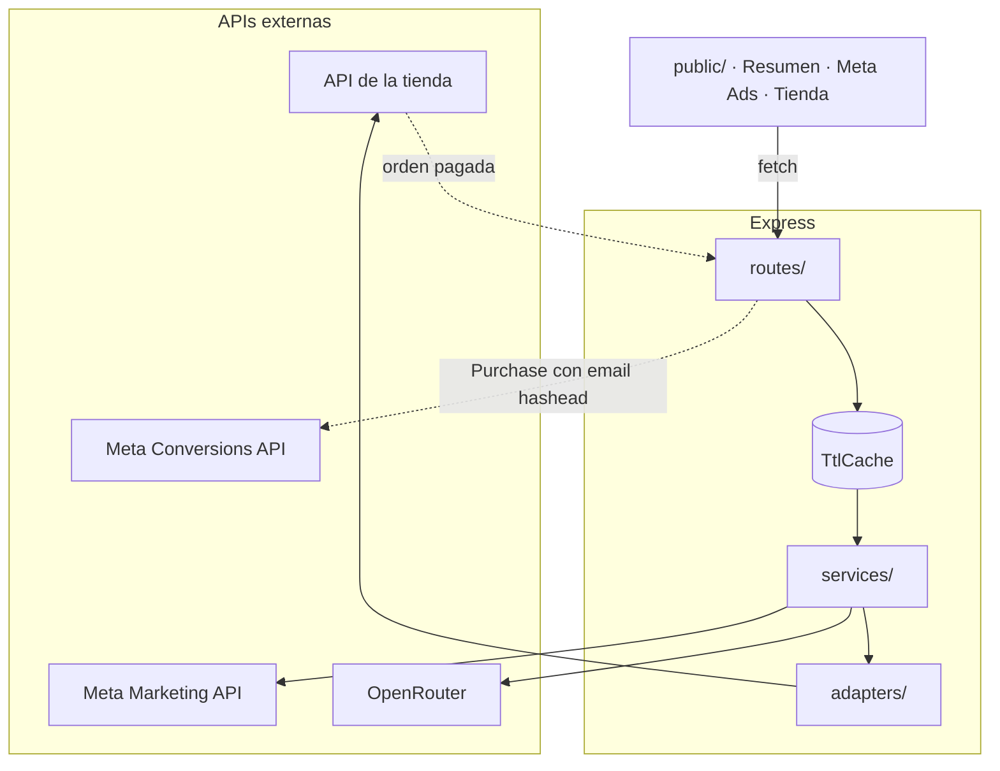

# Arquitectura

Node + Express, sin build step, sin framework de frontend. El objetivo era que
alguien pueda clonar esto, leer un archivo y entender qué hace.

## Los archivos

```
src/
├── server.js            arranque: puerto, banner, señales, navegador
├── app.js               ensambla la app y devuelve las piezas (los tests la usan)
├── config.js            .env → objeto congelado + lista de lo que falta
│
├── lib/                 sin dependencias del dominio
│   ├── http.js          todo pedido externo, siempre con timeout
│   ├── cache.js         TtlCache con tope de entradas
│   ├── dates.js         la única fuente de verdad de los períodos
│   ├── logger.js        consola + archivo, escritura asíncrona
│   └── express.js       asyncRoute, httpError, middleware de error
│
├── adapters/            lo único que sabe de una plataforma concreta
│   ├── index.js         registro por STORE_PLATFORM
│   ├── tiendanube.js
│   └── README.md        el contrato del pedido normalizado
│
├── services/            la lógica
│   ├── meta.js          Marketing API + ciclo de vida del token
│   ├── conversions.js   armado y envío del evento Purchase
│   ├── analytics.js     funciones puras sobre pedidos normalizados
│   └── ai.js            prompt, llamada a OpenRouter, saneado
│
├── routes/              HTTP: validar, llamar, responder
│   ├── health.js  meta.js  store.js  summary.js  analyze.js  webhook.js
│
├── data/nombres-ar.json
└── public/
    ├── index.html
    ├── css/dashboard.css
    └── js/  core.js → summary.js → meta-ads.js → store.js → app.js
```

La regla que ordena todo esto: **una capa no salta a otra que no le toca**. Una
ruta no arma un pedido HTTP. Un servicio no lee `process.env`. Un adaptador no
calcula fechas. Cuando algo no encaja en ninguna, es señal de que falta una
pieza, no de que hay que meterlo en la más cercana.

## El flujo



Un solo flujo va en sentido inverso: el webhook, que en vez de leer datos
escribe hacia Meta. Está en [webhook.md](webhook.md).

## Las cuatro decisiones que importan

### 1. La capa de adaptadores

El dashboard cruza gasto publicitario contra **plata cobrada**. De dónde sale
esa plata es intercambiable.

Todo lo que sabe cómo se llaman los campos de Tiendanube está en un archivo. El
resto trabaja sobre un **pedido normalizado**: importes numéricos, email en
minúsculas, `createdAt` de cuándo se compró. Sumar Shopify es escribir
`adapters/shopify.js` y registrarlo — no se toca ninguna ruta ni ningún cálculo.

El contrato completo, con el porqué de cada campo, en
[src/adapters/README.md](../src/adapters/README.md).

### 2. Las fechas en un solo lugar

Esta lógica estaba escrita tres veces y cada copia se corría un día distinta. El
síntoma visible era que el gráfico diario dibujaba un día más que el número de
arriba, con las dos cosas en la misma pantalla.

Ahora `lib/dates.js` produce rangos `[inicio, fin)` alineados a medianoche
local, con la misma semántica que el `date_preset` de Meta. Si el gasto midiera
un período y los ingresos otro, el cociente de los dos no sería el ROAS de nada.

Tiene tests, incluido el cruce de fin de año.

### 3. Caché en memoria, TTL 10 minutos

No es una optimización opcional. Sin esto, cada clic le pegaba de nuevo a las
dos APIs: rate limit de Meta, y tokens de IA quemados sobre datos idénticos.

El histórico de la tienda tiene su propio TTL de 30 minutos: recorre cientos de
páginas de órdenes. `/api/analyze` cachea por **hash del contenido**, así que
los mismos datos de entrada nunca se pagan dos veces.

El caché tiene tope de entradas y descarta la más vieja. Sin tope, una clave por
combinación de cuenta y período crece sin límite en un proceso que corre meses.

### 4. Nada se cae por una credencial que falta

Cada integración se chequea por separado. Lo que falta se dice **al arrancar**,
con el nombre de la variable y el link al doc. Cada sección sin configurar
devuelve `503` con su motivo, y el frontend lo muestra.

Los `503` no ensucian el log: no son fallas, son estados.

## Qué se rompió antes, y qué lo evita ahora

| Lo que pasaba | Qué lo evita |
|---|---|
| Pantalla en blanco con muchas órdenes | Timeout obligatorio en `lib/http.js`. No hay forma de hacer un pedido sin uno |
| Cada compra contada dos veces en Meta | `event_id` en el evento. Con test |
| Compras infladas en los insights | `omni_purchase` **o** `purchase`, nunca los dos sumados. Con test |
| "Hora pico" tres horas corrida | La hora sale del offset del propio timestamp, no de UTC. Con test |
| El grafico y las métricas no coincidían | Un solo `lib/dates.js` |
| Tiendanube reintentaba el webhook | `200` antes de procesar, y log asíncrono |
| Errores de Meta que parecían "cuenta sin gasto" | Meta responde `200` con `error`; se traduce a `400` con el mensaje |
| Cualquier web podía leer las métricas desde localhost | CORS cerrado por defecto, orígenes explícitos |
| Un endpoint abría una terminal en la máquina | Se eliminó |

## El frontend

Un `index.html` y cinco archivos de JS que se cargan en orden y comparten el
scope global. Sin bundler y sin módulos, a propósito: abrís el archivo y lo leés.

El precio es que un nombre mal escrito no falla hasta que el usuario hace clic.
La red contra eso es `no-undef` de ESLint, con los globales que cruzan archivos
declarados en `eslint.config.js`. **Si agregás uno nuevo que cruza archivos,
sumalo ahí.**

`core.js` tiene que ir primero: define `CONFIG`, y todo lo demás formatea
números con él. `app.js` va último porque arranca.

Nada del negocio está escrito en el HTML: nombre, moneda y locale salen de
`/api/health` y se vuelcan sobre atributos `data-*`.

Las reglas visuales están en [diseno.md](diseno.md); las decisiones de
presentación, contrastadas contra productos reales, en
[referencias.md](referencias.md).

## Tests

`node:test`, sin dependencias. `npm test`.

`app.js` devuelve la app sin levantarla, así que `test/api.test.js` monta el
servidor entero con adaptadores falsos y verifica los contratos HTTP: qué código
devuelve cada error, que el alias `/api/tn` siga funcionando, que CORS esté
cerrado, que el webhook responda antes de procesar, que ningún token aparezca en
`/api/health`.

Ningún test toca la red.

## Lo que falta

Ver [estado.md](estado.md).
